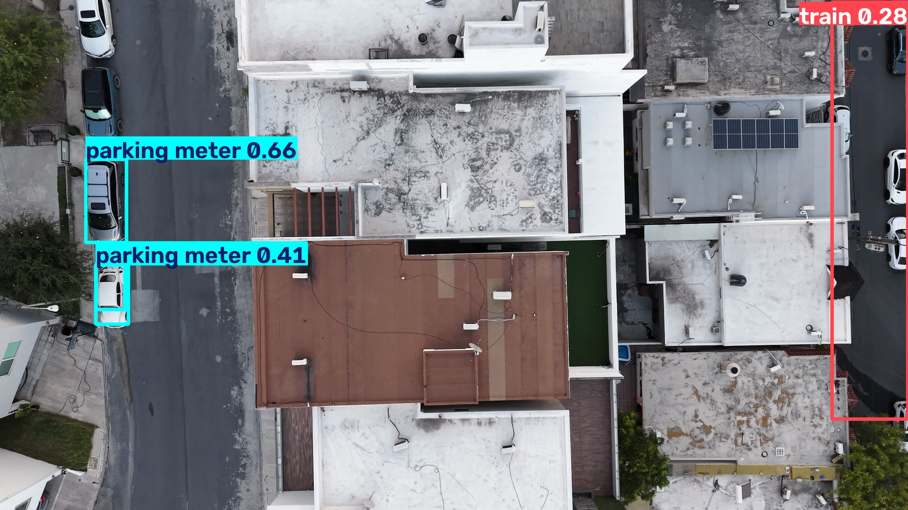
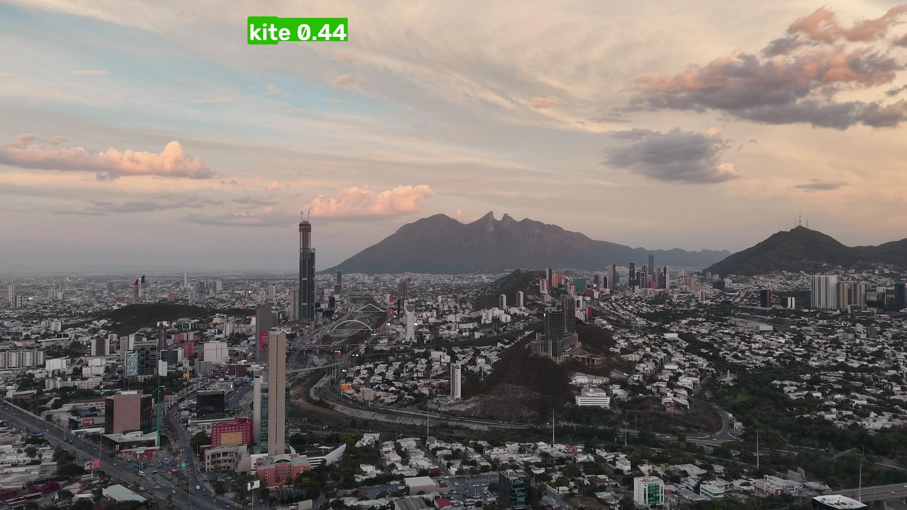

# drone-vision

> Aerial video → object detection → **an analysis of why detection fails under real capture conditions.**



---

## Why I built this

I'm a Computer Science student and a photographer. I own the drone, two cameras and four lenses used to shoot the footage in this project.

Any CS student can call YOLO. Far fewer can explain *why* the model breaks under backlight, motion blur, or a nadir camera angle — because that requires understanding exposure, sensor behaviour and optics, not just an API.

That analysis is the point of this repo. The pipeline is just what makes the analysis possible.

---

## Findings

Dataset: 10 real DJI flights (1920×1080 @ 24fps, 27s–155s each), 603 frames sampled at 1fps, run through YOLOv8n at the default 0.25 confidence threshold. Full numbers in `output/stats_frames.csv` and `output/stats_por_clase.csv`.

### 1. Underexposure kills detection almost completely

Frames darker than ~117 mean brightness detect at roughly **26%**, against **62%** in the mid-range (128–131). One entire clip (38 frames, 0 detections) sits squarely in that dark band — it was shot into shade/backlight, and the detector never recovers.


### 2. Motion blur from drone movement destroys the edges YOLO needs

Frames with Laplacian variance (sharpness) below ~406 detect at **~24%**, peaking at **~65%** in the 807–931 range. Every hard yaw or fast pass through the frame softens edges enough to drop objects the model would otherwise catch — same object, same lighting, gone once the drone moves too fast.


### 3. Nadir angle doesn't just lower confidence — it changes the answer entirely

This is the one a confusion-matrix summary won't show you: when the camera looks straight down, YOLO doesn't just get *less sure*, it gets a **different, wrong, confident answer**. A parked car photographed from directly overhead — no side profile, no windshield, just a rectangle with a roofline — gets classified as `parking meter` (0.66 confidence) and `train` (0.28) in the same frame. COCO was built from ground-level and social-media photography; it has almost no top-down imagery, so nadir shots fall into a genuine blind spot in the training distribution, not just a hard lighting case.


The same domain gap produces false positives in the other direction: a wide skyline shot at golden hour, with a bright cloud bank and no kite anywhere in frame, gets tagged `kite` (0.44–0.56) consistently across 20+ consecutive frames — the model latches onto *something* in the hazy, backlit sky that resembles the silhouette it was trained on.



### What didn't hold up

Highlight clipping (`pct_quemado`) showed no meaningful pattern — median clipping across the dataset was under 1%, so these flights never produced the kind of blown-out overexposure that would test that hypothesis. Worth revisiting with footage shot directly into the sun.

---

## How it works

```
video ──► extract.py ──► frames + optical metrics ──► detect.py ──► detections.json
                         (brightness, sharpness,                    (class, confidence,
                          highlight clipping)                        bbox, per frame)
                                                                            │
                                                              (multiple videos) merge.py
                                                                            │
                                                                            ▼
                                                                    analyze.py ──► stats + charts
```

`extract.py` measures three things per frame while it decodes:

| Metric | How | Why it matters |
|---|---|---|
| **Mean brightness** | HSV *V* channel mean | *V* = max(R,G,B), so it catches highlight clipping before an RGB average does — blue sky drags an RGB mean down and hides the blowout |
| **Sharpness** | Variance of the Laplacian | Drops when the drone yaws; motion blur softens the edges detectors depend on |
| **% clipped** | Share of pixels with V ≥ 250 | Mean brightness can look fine while 15% of the scene is unrecoverable |

These are computed during extraction, not later — decoding the frame is the expensive step, and Phase 2 shouldn't pay it twice.

---

## Run it

```bash
git clone <repo-url>
cd drone-vision
python3.13 -m venv .venv && source .venv/bin/activate   # 3.14 currently lacks opencv/ultralytics wheels
pip install -r requirements.txt

# single video:
python src/extract.py data/raw/your_flight.MP4
python src/detect.py --annotate
python src/analyze.py
```

Output lands in `output/detections.json`, already joined with the per-frame optical metrics, plus `output/stats_frames.csv`, `output/stats_por_clase.csv` and the charts in `output/charts/`.

Runs on CPU with `yolov8n.pt`. Weights download automatically on first run.

**Multiple videos** (this is how the dataset above was actually built — 10 clips from one flight session):

```bash
for f in data/raw/*.MP4; do
    nombre=$(basename "${f%.*}")
    python src/extract.py "$f" --out "data/frames/$nombre" --meta "output/frames_meta_$nombre.json"
    python src/detect.py --frames "data/frames/$nombre" --meta "output/frames_meta_$nombre.json" --out "output/detections_$nombre.json"
done
python src/merge.py
python src/analyze.py
```

**Options**

```bash
python src/extract.py data/raw/flight.MP4 --fps 2      # sample 2 frames/second
python src/detect.py --conf 0.35                        # raise confidence threshold
python src/detect.py --modelo yolov8s.pt                # bigger model, slower
```

---

## Limitations

- **Pretrained on COCO.** The classes are ground-level categories — `person`, `car`, `truck`. COCO contains almost no nadir aerial imagery, so low confidence on overhead shots is a *domain gap*, not a bug. Quantifying that gap is part of the point.
- **No tracking.** Each frame is scored independently. An object detected in frame 4 and missed in frame 5 counts as two separate events.
- **Sharpness is relative.** Laplacian variance depends on resolution, lens and scene content. Only compare frames from the same clip.
- **No ground truth.** There are no manual annotations, so this measures *confidence*, not accuracy. A confident wrong detection looks the same as a confident right one here.
- **No altitude from telemetry yet.** Altitude is annotated by hand.

---

## AI assistance

I used Claude Code throughout — for scaffolding `extract.py`/`detect.py`/`analyze.py`, for setting up the environment, and for a first pass on this findings section. What I had to catch and correct:

- **The first version of the detection-rate-by-brightness chart was misleading.** It used fixed-width bins, and the darkest/brightest bins only had 1-2 frames in them — one lucky detection in a 1-frame bin rendered as a "100% detection rate" bar. I had it switch to quantile-based bins so every bar represents a comparable sample size, and re-generated the chart before trusting the pattern.
- **The multi-video merge step wasn't in `detect.py`/`extract.py` at all.** Both scripts were written for a single video. When the real footage turned out to be 10 clips instead of one, the first pass fused them with a throwaway inline Python snippet — not committed anywhere, not reproducible. I asked for that logic to become a real script (`merge.py`) instead of leaving the dataset's actual provenance undocumented.
- **The "kite" and "parking meter" false positives could have been reported from the raw JSON numbers alone.** I asked Claude to pull the actual annotated frames before writing the finding, since a bounding box label in a JSON file isn't evidence by itself — I wanted to see the frame and confirm there genuinely was no kite in it before writing the claim into the README.
- Claude picked Python 3.13 for the venv over the system default 3.14, because OpenCV/Ultralytics don't ship wheels for 3.14 yet. That's a reasonable call, but it was made without asking — worth double-checking on a machine with a different Python setup rather than assuming it always applies.
