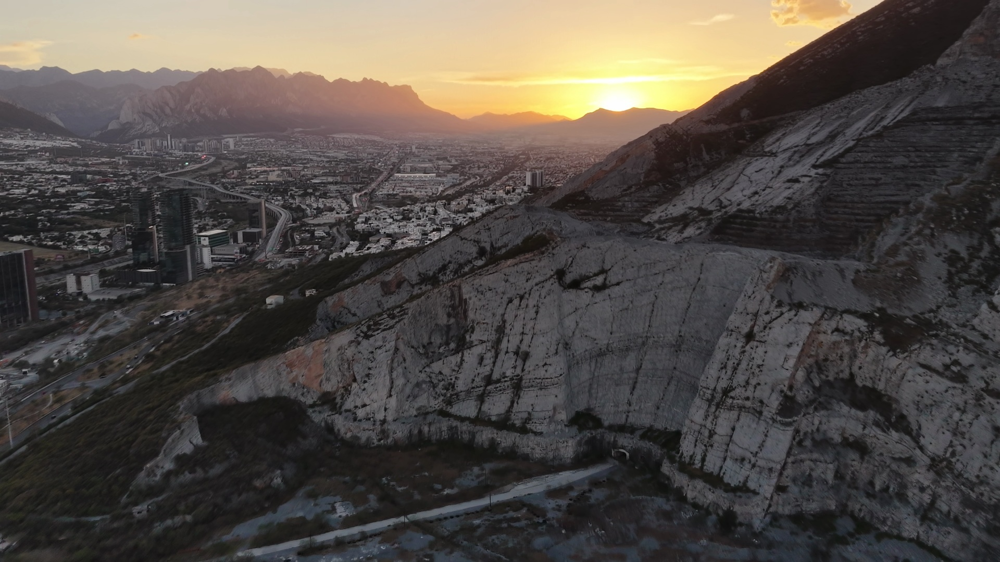

# drone-vision

> Aerial video in, object detection out, and an analysis of why detection fails under real capture conditions.


---

## Why I built this

I'm a Computer Science student and a photographer. I own the drone, two cameras and four lenses used to shoot the footage in this project.

Any CS student can call YOLO. Fewer can explain why the model breaks under backlight, motion blur, or a nadir camera angle, because that takes understanding exposure, sensor behavior and optics, not just an API. That analysis is the point of this repo. The pipeline is just what makes it possible.

---

## Findings

Dataset: 10 real DJI flights, 1920×1080 at 24fps, 27 to 155 seconds each. 603 frames sampled at 1fps, run through YOLOv8n at the default 0.25 confidence threshold. Full numbers in `output/stats_frames.csv` and `output/stats_por_clase.csv`.

### 1. Underexposure kills detection almost completely

Frames darker than about 117 mean brightness detect at roughly 26%. Frames in the mid range (128 to 131) detect at 62%. One entire clip, 38 frames, 0 detections, sits squarely in that dark band. It was shot into shade at dusk, and the detector never recovers.


Here's a frame from that clip. Nothing gets detected, not because there's nothing there, but because the exposure buried it.



### 2. Motion blur from drone movement destroys the edges YOLO needs

Frames with sharpness (Laplacian variance) below about 406 detect at only 24%, peaking at 65% in the 807 to 931 range. A hard yaw or a fast pass through the frame softens edges enough to drop objects the model would otherwise catch. Same object, same lighting, gone once the drone moves too fast.


### 3. Nadir angle doesn't just lower confidence, it changes the answer

This is the finding a confidence score alone won't show you. When the camera looks straight down, YOLO doesn't just get less sure, it gets a different, confidently wrong answer. A parked car photographed from directly overhead has no side profile and no windshield, just a rectangle with a roofline, and gets classified as `parking meter` (0.66 confidence) and `train` (0.28) in the same frame. Below is that exact frame, next to a clean nadir shot where the same class of object, cars viewed from directly above, gets correctly detected at 0.5 to 0.8 confidence. The angle is the same in both. What's different is scale and clutter: the misclassified cars are boxed in against buildings and roughly half the pixel area of the correctly detected ones, which sit on open pavement. Nadir angle alone doesn't guarantee failure, it just removes the margin for error everything else was providing.

COCO was built from ground level and social media photography. It has almost no top down imagery, so nadir shots hit a real blind spot in the training distribution, not just a hard lighting case.


The same domain gap produces false positives in the other direction. A wide skyline shot at golden hour, bright cloud bank, no kite anywhere in frame, gets tagged `kite` at 0.44 to 0.56 confidence across more than 20 consecutive frames. The model latches onto something in the hazy, backlit sky that resembles the silhouette it was trained on.


### What didn't hold up

Highlight clipping (`pct_quemado`) showed no meaningful pattern. Median clipping across the dataset was under 1%, so these flights never produced the kind of blown out overexposure that would actually test that hypothesis. Worth revisiting with footage shot straight into the sun.

---

## How it works

```
video ──► extract.py ──► frames + optical metrics ──► detect.py ──► detections.json
                         (brightness, sharpness,                    (class, confidence,
                          highlight clipping)                        bbox, per frame)
                                                                            │
                                                              (multiple videos) merge.py
                                                                            │
                                                                            ▼
                                                                    analyze.py ──► stats + charts
```

`extract.py` measures three things per frame while it decodes.

| Metric | How | Why it matters |
|---|---|---|
| Mean brightness | HSV V channel mean | V is max(R,G,B), so it catches highlight clipping before an RGB average does. Blue sky drags an RGB mean down and hides the blowout. |
| Sharpness | Variance of the Laplacian | Drops when the drone yaws. Motion blur softens the edges detectors depend on. |
| % clipped | Share of pixels with V ≥ 250 | Mean brightness can look fine while 15% of the scene is unrecoverable. |

These are computed during extraction, not later. Decoding the frame is already the expensive step, no reason to pay it twice.

---

## Run it

```bash
git clone <repo-url>
cd drone-vision
python3.13 -m venv .venv && source .venv/bin/activate   # 3.14 currently lacks opencv/ultralytics wheels
pip install -r requirements.txt

# single video:
python src/extract.py data/raw/your_flight.MP4
python src/detect.py --annotate
python src/analyze.py
python src/report.py
```

Output lands in `output/detections.json`, already joined with the per-frame optical metrics, plus `output/stats_frames.csv`, `output/stats_por_clase.csv`, the charts in `output/charts/`, and a readable `output/report.md` with the per-video and per-class breakdown these findings are drawn from.

Runs on CPU with `yolov8n.pt`. Weights download automatically on first run.

**Multiple videos.** This is how the dataset above was actually built, 10 clips from one flight session:

```bash
for f in data/raw/*.MP4; do
    nombre=$(basename "${f%.*}")
    python src/extract.py "$f" --out "data/frames/$nombre" --meta "output/frames_meta_$nombre.json"
    python src/detect.py --frames "data/frames/$nombre" --meta "output/frames_meta_$nombre.json" --out "output/detections_$nombre.json"
done
python src/merge.py
python src/analyze.py
python src/report.py
```

**Options**

```bash
python src/extract.py data/raw/flight.MP4 --fps 2      # sample 2 frames/second
python src/detect.py --conf 0.35                        # raise confidence threshold
python src/detect.py --modelo yolov8s.pt                # bigger model, slower
```

---

## Limitations

- **Pretrained on COCO.** The classes are ground level categories: person, car, truck. COCO contains almost no nadir aerial imagery, so low confidence on overhead shots is a domain gap, not a bug. Quantifying that gap is part of the point.
- **No tracking.** Each frame is scored independently. An object detected in frame 4 and missed in frame 5 counts as two separate events.
- **Sharpness is relative.** Laplacian variance depends on resolution, lens and scene content. Only compare frames from the same clip.
- **No ground truth.** There are no manual annotations, so this measures confidence, not accuracy. A confident wrong detection looks the same as a confident right one here.
- **No altitude from telemetry yet.** Altitude isn't logged or annotated in this version.

---

## AI assistance

I used Claude Code to scaffold the scripts, set up the environment, and draft this findings section. A few things I had to catch and fix along the way:

The first brightness chart was misleading, fixed-width bins left the darkest and brightest buckets with 1-2 frames each, so a single lucky detection showed up as a 100% bar. I had it rebuilt with quantile bins so every bar represents a comparable sample.

The multi-video merge step didn't exist in the original scripts, they were written for one video at a time. When the real footage turned out to be 10 clips, the first pass stitched them together with a throwaway script that never got committed. I asked for that to become a real, reusable script instead.

Before writing the kite and parking meter findings, I asked to see the actual frames, not just the JSON. A bounding box label by itself isn't evidence.

Claude also picked Python 3.13 for the venv over the system's 3.14 default, since OpenCV and Ultralytics don't have 3.14 wheels yet. Reasonable call, but it made it without asking, worth double-checking on a different machine.
