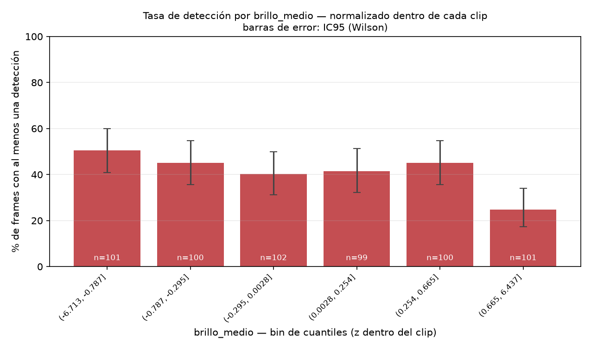
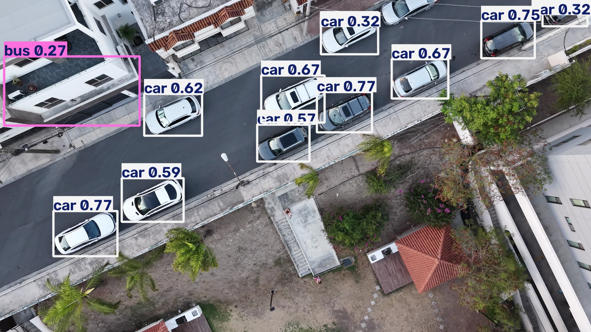

# drone-vision

> Aerial video in, object detection out, and an audit of which apparent failure modes survive contact with the data and which turn out to be an artifact of how the data was aggregated.


---

## Why I built this

I'm a Computer Science student and a photographer. I own the drone, the two cameras and the four lenses used to shoot the footage here, so I can generate capture conditions instead of downloading them. I know what a histogram looks like before I know what a confusion matrix looks like.

The original question was simple. My own aerial footage makes off-the-shelf detectors behave strangely, so can I measure why instead of guessing?

The answer turned out to be more interesting than the question, and not in the direction I expected. Two of the three failure modes I thought I had found were confounding. Working out which one was real is what this repo actually documents.

---

## Dataset and method

**10 clips from a single 12-minute evening flight** (2026-08-17, 18:57 to 19:09), 1920×1080 at 24 fps, 27 to 155 seconds each. 603 frames sampled at 1 fps, run through COCO-pretrained **YOLOv8n at the default 0.25 confidence threshold and the default `imgsz=640`**.

Three optical metrics are computed per frame during decoding: mean brightness (HSV V channel), sharpness (variance of the Laplacian), and the share of clipped highlight pixels.

**Global result: 41.1% of frames produced at least one detection. 355 of 603 frames produced none.** 387 detections total across 22 COCO classes.

Two definitions, stated up front because they bound everything below.

- **"Detection rate" means the share of frames with at least one detection at confidence 0.25 or higher.** It is not recall. There is no ground truth in this dataset, so a frame with zero detections and a frame with zero objects look identical here.
- **The experimental unit is the clip, not the frame.** There are 603 observations but only **10 independent takes**, all from one location, one time of day, one light. Treating 603 frames as 603 independent samples is pseudoreplication, and it's exactly the error that produced my first two "findings."

Full numbers in [`output/report.md`](output/report.md), plus `output/stats_frames.csv`, `stats_por_clip.csv`, `stats_por_clase.csv`, `stats_correlaciones.csv`.

---

## Findings

### 1. The brightness effect is real between clips and reverses inside them

This is Simpson's paradox, and it's the mistake that shaped the rest of this section.

Aggregating all 603 frames into brightness quantiles produces a clean, publishable-looking story: the darkest bin detects at **25.7%**, the mid range peaks at **62.4%**. "Underexposure kills detection." That was my first draft of this section.

It's wrong. When I z-score brightness **within each clip**, which is the only comparison the metric actually supports, the relationship inverts.

| | aggregate | within-clip |
|---|---:|---:|
| Pearson *r*, brightness vs. detection | **+0.124** | **−0.128** |
| Darkest sextile | 25.7% | **50.5%** |
| Brightest sextile | 43.0% | **24.8%** |




Inside a single clip, brighter frames detect slightly less. The aggregate pattern comes from two dusk clips that happened to be both darker and emptier than the rest. Decomposing the dark bin by source clip:

| clip | frames in dark bin | detection rate |
|---|---:|---:|
| `…_0008_D` | 25 | **0.0%** |
| `…_0007_D` | 42 | 21.4% |
| `…_0006_D` | 22 | **54.5%** |
| `…_0010_D` | 10 | **50.0%** |
| `…_0005_D` | 2 | 0.0% |

Drop clip 0008 and the dark bin goes to 34.2%. Drop 0007 as well and it goes to **50.0%**, better than the 41.1% dataset average. The dark frames of clips 0006 and 0010 detect fine. The "underexposure" effect is two clips wearing a trench coat.

**And nothing here is actually underexposed.** Per-clip mean V runs from **110.0 to 139.5** on a 0 to 255 scale. A mean of 110 is slightly below mid-grey, a correctly exposed dusk scene, not a dark one. Mean brightness is the wrong summary statistic for a high-dynamic-range scene: clip 0008 pairs that mean of 110 with the highest highlight clipping in the set, the signature of a blown sky over a shadowed foreground. A photographer would look at the histogram, not the mean. `extract.py` now records shadow percentage and V percentiles for exactly this reason. The flights predate that change, so re-running it is the obvious next step.

### 2. Laplacian sharpness predicts nothing once you control for the clip, and the reason is `imgsz`

Same shape of error, more complete collapse. The aggregate chart looks like a story: 23.8% in the least-sharp bin, peaking at 65.3%. But it isn't even monotonic, it goes 23.8, 40.0, **65.3**, 49.0, 33.0, 35.6. The sharpest bin in the dataset detects worse than the middle one. Quoting only the rising half of an inverted U is cherry-picking, even when it's unintentional.

Normalize within clip and the effect is gone entirely.

| sextile of within-clip sharpness | frames | detection rate |
|---|---:|---:|
| lowest | 101 | 42.6% |
| | 100 | 35.0% |
| | 101 | 43.6% |
| | 100 | 43.0% |
| | 100 | 48.0% |
| highest | 101 | 34.7% |

Pearson *r* = **0.003**. Flat. What the aggregate chart was separating was clips, not motion blur: the peak bin is 52% frames from clip 0009 alone, the highest-detecting clip in the set.

**Why it can't have worked, mechanically.** Ultralytics defaults to `imgsz=640`. A 1920×1080 frame is letterboxed to roughly 640×360 before inference, a third of the linear resolution and a ninth of the area. I was measuring Laplacian variance at full resolution on an image the model never sees. A 3x downsample is a far more aggressive low-pass filter than any residual blur a gimballed DJI leaves behind. The resample dominates the blur, so the metric can't correlate with a model that never had access to the difference.

That also reframes finding 3 below. A car at 8,779 px² at full resolution is around 975 px² at 640, about 31 by 31 pixels. YOLOv8n's stride-8 features give that object roughly a 4 by 4 grid. `--imgsz` is now exposed on the CLI. Re-running a single clip at 1280 is a genuine controlled experiment (same frames, same scene, same light, one variable) and it's the top item in [`IDEAS.md`](IDEAS.md).

### 3. At nadir the model doesn't get uncertain, it gets confidently wrong

This is the finding that survives, and it survives because it isn't statistical. It's a specific frame with specific numbers you can check in `output/detections.json`.

`…_0010_D`, `frame_00045_t0045.04.jpg`. Three parked cars shot from directly overhead:

| detection | confidence | box area |
|---|---:|---:|
| `parking meter` | **0.66** | 15,102 px² |
| `parking meter` | 0.42 | 8,779 px² |
| `parking meter` | 0.37 | 5,716 px² |
| `train` | 0.28 | 141,336 px² |


Confidence didn't degrade gracefully. The model produced a different, confident answer. A car from directly above has no side profile and no windshield, just a rectangle with a roofline, and that shape isn't in the training distribution as a car.

But nadir angle alone doesn't cause it. Here's `…_0006_D`, `frame_00108`, also near-nadir by eye, where nine cars come out correctly at 0.37 to 0.80:



The difference is scale and clutter. The misclassified boxes are 5,716 to 15,102 px² against buildings; the correct ones are 9,304 to 25,466 px² (median 19,643) on open pavement. The failures are roughly **45% of the median area** of the successes. Nadir doesn't guarantee failure, it removes the margin everything else was providing. (Gimbal pitch isn't logged in this version, so "near-nadir" is a visual judgement, not a measurement.)

The same domain gap runs the other way. In `…_0009_D`, a wide skyline at golden hour with a bright cloud bank and no kite anywhere in frame, the model tags `kite` across **37 consecutive frames** (46 frames in the clip total), confidence **0.25 to 0.56**, median 0.38. It latches onto something in the hazy backlit sky that matches a silhouette it was trained on.


COCO was built from ground-level and social-media photography. It contains almost no top-down imagery, so this is a training-distribution blind spot, not a hard-lighting case. Published UAV benchmarks show the same collapse at much larger scale: detectors above 50% mAP on COCO fall to the 15 to 40% range on VisDrone.

### 4. Highlight clipping: how the wrong plot hid a real number, and why the real number still isn't a finding

My first pass concluded that highlight clipping showed no pattern. That conclusion came from a scatter of **confidence per detection** against clipping, and that plot is structurally incapable of showing the effect, because it only contains frames where a detection exists. If clipping causes zero detections, those frames vanish from the plot. It's a collider, not an absence of signal.

The detection-rate view, which I hadn't generated, says something very different.

- 32 frames above 2% clipping: **3.1%** detection rate
- 571 frames at or below: **43.3%**

That's a factor of 14. And it's still **not a finding**, because 28 of those 32 frames come from clips 0007 and 0008, the same two clips driving finding 1. Within-clip Pearson *r* is **0.014**. It's the same confound, not independent evidence. Properly testing it needs footage shot into the sun across several separate flights.

I'm keeping this section because the mistake is the instructive part. The conclusion happened to be defensible, but the reasoning that produced it was broken, and I'd rather be caught having found that myself.

---

## What this dataset can and cannot support

**Can:** clip-level statements (this clip detected at 0%, that one at 64%), and the nadir/false-positive analysis, which rests on named frames rather than aggregates.

**Cannot:** any causal claim about brightness, sharpness or clipping. With 10 clips from one session, one location and one hour of the day, the effective sample size for a between-clip effect is 10, and every optical metric is confounded with clip identity. The honest version of findings 1 and 2 is "the aggregate patterns I first published were Simpson's paradox, here are both charts."

---

## How it works

```
video ──► extract.py ──► frames + optical metrics ──► detect.py ──► detections.json
                         (brightness, luminance,                    (class, confidence,
                          sharpness, clipping,                       bbox, area, per frame)
                          shadows, V percentiles)                           │
                                                              (multiple clips) merge.py
                                                                            │
                                                                            ▼
                                                              analyze.py ──► stats + charts
                                                                            │
                                                                            ▼
                                                                    report.py ──► report.md
```

`extract.py` measures everything in a single colour conversion while it decodes. The frame decode is already the expensive step.

| Metric | How | Why it matters |
|---|---|---|
| Mean brightness | HSV V channel mean | V is max(R,G,B), so it catches highlight clipping before an RGB average does. Blue sky drags an RGB mean down and hides the blowout. It is not luminance, and is biased upward for exposure. |
| Mean luminance | Rec.601 grey | The correct statistic for exposure. Reported alongside V precisely because they disagree. |
| Sharpness | Variance of the Laplacian | Drops when the drone yaws. Resolution and scene dependent, so `analyze.py` normalizes it within clip. |
| % clipped | Share of pixels with V ≥ 250 | Mean brightness can look fine while a chunk of the scene is unrecoverable. |
| % shadows, V p5/p50/p95 | Percentiles of V | A mean of 110 can be a normal scene or a blown sky over black foreground. Only the histogram distinguishes them. |

`analyze.py` produces every chart twice, aggregate and within-clip, with n labelled on each bar and Wilson 95% intervals drawn. The intervals matter: at n≈100, a 65% bar and a 49% bar overlap. Bins are quantiles, not fixed width, so every bar has a comparable sample behind it.

---

## Run it

```bash
git clone https://github.com/Paco-Sauceda/Computer-Vision-Drone
cd Computer-Vision-Drone
python3.13 -m venv .venv && source .venv/bin/activate   # 3.14 lacks opencv/ultralytics wheels
pip install -r requirements.txt

# single clip
python src/extract.py data/raw/your_flight.MP4
python src/detect.py --annotate
python src/analyze.py
python src/report.py
```

Runs on CPU with `yolov8n.pt`. Weights download on first run.

**Multiple clips**, how the dataset above was actually built:

```bash
for f in data/raw/*.MP4; do
    nombre=$(basename "${f%.*}")
    python src/extract.py "$f" --out "data/frames/$nombre" --meta "output/frames_meta_$nombre.json"
    python src/detect.py --frames "data/frames/$nombre" --meta "output/frames_meta_$nombre.json" --out "output/detections_$nombre.json"
done
python src/merge.py && python src/analyze.py && python src/report.py
```

`merge.py` refuses to merge clips run with different models or thresholds rather than silently reporting the last one.

**Options**

```bash
python src/extract.py data/raw/flight.MP4 --fps 2   # sample 2 frames/second
python src/detect.py --conf 0.35                     # raise confidence threshold
python src/detect.py --imgsz 1280                    # inference resolution (default 640)
python src/detect.py --modelo yolov8s.pt             # bigger model, slower
python src/analyze.py --bins 8                       # number of quantile bins
```

---

## Limitations

- **No ground truth.** No manual annotations, so this measures detection rate and confidence, not recall or precision. A confident wrong detection looks identical to a confident right one in the aggregate numbers.
- **10 clips, one session.** One location, one time of day, one light. Every optical metric is confounded with clip identity, see "What this dataset can and cannot support" above.
- **Pretrained on COCO.** Ground-level classes, almost no nadir imagery. Low confidence overhead is a domain gap, not a bug. Quantifying it is part of the point.
- **`imgsz=640`.** Inference sees roughly a ninth of the pixel area of the source frames. Much of the 41% detection rate may be resolution, not domain gap. Untested until the 1280 run.
- **No tracking.** Each frame is scored independently; an object detected in frame 4 and missed in frame 5 counts as two events.
- **Metrics are pre-JPEG, detection is post-JPEG.** Optical metrics are computed on the decoded frame; YOLO runs on the written JPEG. Second-order next to the downsample, but it's a seam.
- **No telemetry.** Altitude and gimbal pitch aren't logged. DJI writes both into XMP tags, reading them is the highest-value unbuilt feature here.

---

## AI assistance

I used Claude Code across a few sessions to scaffold the scripts and draft prose. Things I caught and corrected along the way:

The first brightness chart was misleading. Fixed-width bins left the darkest and brightest buckets with 1 to 2 frames each, so a single lucky detection showed up as a 100% bar. I had it rebuilt with quantile bins.

The multi-clip merge step didn't exist. The scripts were written for one video at a time. When the footage turned out to be 10 clips, the first pass stitched them with a throwaway script that never got committed. I asked for a real, reusable one instead.

Before writing the kite and parking-meter findings, I asked to see the actual frames, not just the JSON. A bounding-box label by itself isn't evidence.

The Python 3.13-over-3.14 venv decision was made without asking me, since OpenCV and Ultralytics lack 3.14 wheels. Reasonable call, but worth double-checking on a different machine.

The findings themselves needed a second pass. Findings 1 and 2 as originally written were causal claims, "underexposure kills detection," "motion blur destroys edges," over observational data from 10 clips with heavy confounding, and I wrote them that way before checking. A later session ran the within-clip normalization that caught it. The README already declared the limitation ("only compare frames from the same clip") that the first analysis then ignored, which is the kind of gap worth being explicit about rather than quietly fixing.

Before merging that correction in, I re-derived the key numbers independently (the correlation flip, the collider bias in the clipping analysis, the bbox areas in finding 3) against the raw JSON rather than trusting the diff as given. They checked out, but that's the step that made it safe to publish, not the fact that it came from an AI.

---

## Next

Ordered by value per hour, tracked in [`IDEAS.md`](IDEAS.md):

1. **`--imgsz 1280` on one clip.** One variable, same frames. Separates "COCO domain gap" from "inference resolution," currently conflated.
2. **Synthetic blur sweep.** Take 30 sharp frames from clip 0009, apply increasing Gaussian sigma, re-run. Turns the broken observational finding 2 into a controlled experiment, and directly tests the `imgsz` hypothesis (prediction: nothing happens below sigma of about 3, because the downsample already destroyed that information).
3. **Read DJI XMP telemetry**: gimbal pitch, relative altitude, GPS. Turns "near-nadir by eye" into a measurement and enables GSD as a variable.
4. **Annotate about 100 stratified frames by hand** so recall and precision become sayable on a subset.
5. **Re-extract with the histogram metrics** now that `extract.py` records shadows and V percentiles.
