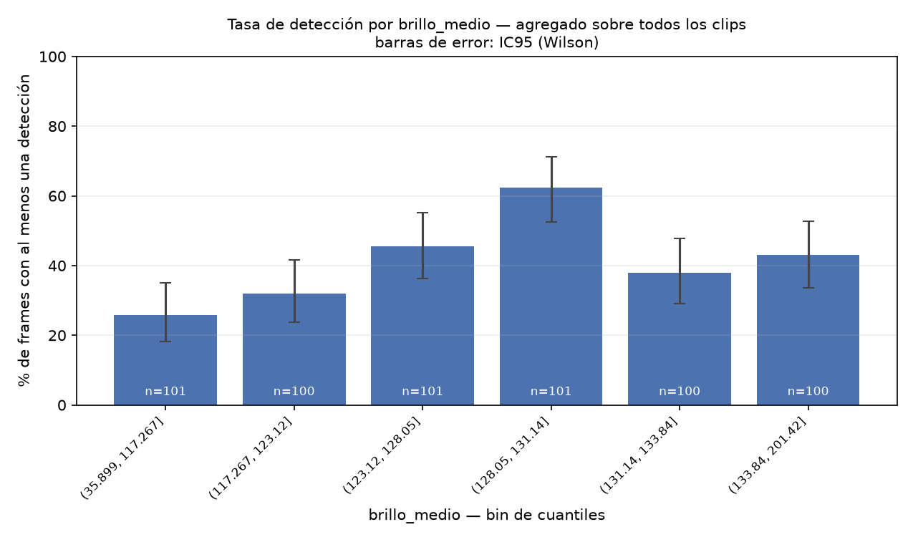
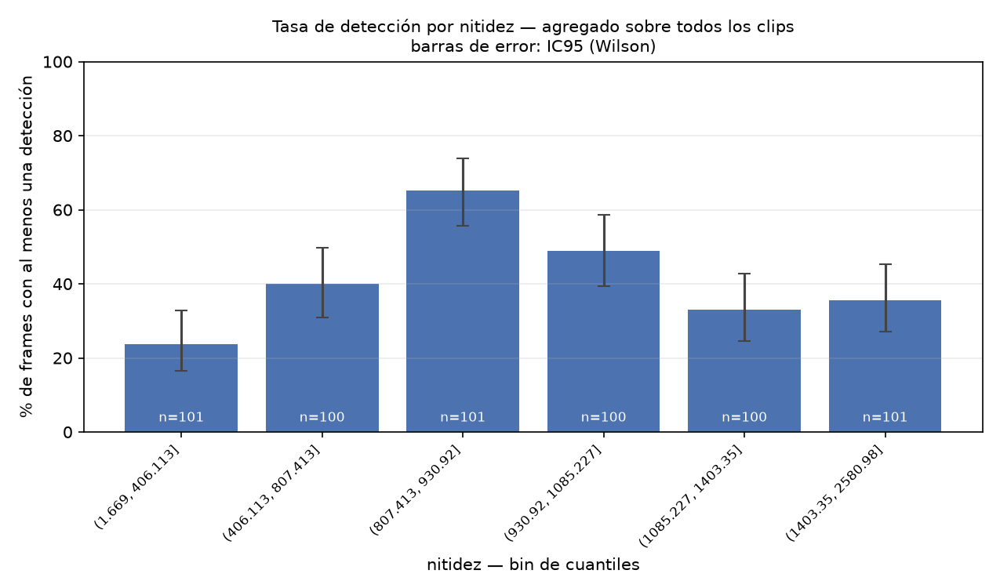

# Reporte — drone-vision

Modelo: `yolov8n.pt` · umbral de confianza: `0.25`

- Videos analizados: **10**
- Frames muestreados (1fps): **603**
- Detecciones totales: **387**
- Frames sin ninguna detección: **355** (58.9% del total)

## Por video

| video                     |   frames |   detecciones |   tasa_deteccion_pct |   brillo_medio |   nitidez_media |
|:--------------------------|---------:|--------------:|---------------------:|---------------:|----------------:|
| DJI_20260817185708_0001_D |       27 |            34 |                 55.6 |          122.8 |          1065.4 |
| DJI_20260817185751_0002_D |       42 |            32 |                 57.1 |          134.3 |           768.3 |
| DJI_20260817185843_0003_D |       47 |            20 |                 36.2 |          139.5 |          1475.2 |
| DJI_20260817185938_0004_D |       37 |             5 |                 13.5 |          120.5 |          1451   |
| DJI_20260817190026_0005_D |       36 |            13 |                 30.6 |          130.2 |          2383.9 |
| DJI_20260817190115_0006_D |      155 |           167 |                 57.4 |          126   |           888.9 |
| DJI_20260817190510_0007_D |       55 |            20 |                 18.2 |          110   |           527.5 |
| DJI_20260817190613_0008_D |       38 |             0 |                  0   |          110   |           464.8 |
| DJI_20260817190704_0009_D |       72 |            51 |                 63.9 |          131.5 |           900.2 |
| DJI_20260817190838_0010_D |       94 |            45 |                 33   |          125.5 |           710.4 |

## Por clase detectada

| clase         |   n_detecciones |   confianza_media |   confianza_std |
|:--------------|----------------:|------------------:|----------------:|
| car           |             168 |             0.403 |           0.144 |
| kite          |              50 |             0.382 |           0.09  |
| train         |              31 |             0.465 |           0.162 |
| person        |              23 |             0.514 |           0.214 |
| truck         |              20 |             0.369 |           0.136 |
| airplane      |              13 |             0.305 |           0.044 |
| bus           |              13 |             0.331 |           0.054 |
| broccoli      |              11 |             0.414 |           0.142 |
| traffic light |              11 |             0.36  |           0.072 |
| bench         |               8 |             0.4   |           0.124 |
| cell phone    |               6 |             0.424 |           0.17  |
| parking meter |               6 |             0.462 |           0.132 |
| potted plant  |               6 |             0.296 |           0.045 |
| clock         |               5 |             0.359 |           0.068 |
| boat          |               4 |             0.39  |           0.13  |
| suitcase      |               3 |             0.365 |           0.13  |
| toilet        |               3 |             0.332 |           0.019 |
| sports ball   |               2 |             0.318 |           0.069 |
| refrigerator  |               1 |             0.819 |         nan     |
| sink          |               1 |             0.378 |         nan     |
| bird          |               1 |             0.322 |         nan     |
| umbrella      |               1 |             0.462 |         nan     |

## Tasa de detección por brillo

| brillo_medio (bin)   |   frames |   tasa_deteccion_pct |
|:---------------------|---------:|---------------------:|
| (35.899, 117.267]    |      101 |                 25.7 |
| (117.267, 123.12]    |      100 |                 32   |
| (123.12, 128.05]     |      101 |                 45.5 |
| (128.05, 131.14]     |      101 |                 62.4 |
| (131.14, 133.84]     |      100 |                 38   |
| (133.84, 201.42]     |      100 |                 43   |

## Tasa de detección por nitidez

| nitidez (bin)       |   frames |   tasa_deteccion_pct |
|:--------------------|---------:|---------------------:|
| (1.669, 406.113]    |      101 |                 23.8 |
| (406.113, 807.413]  |      100 |                 40   |
| (807.413, 930.92]   |      101 |                 65.3 |
| (930.92, 1085.227]  |      100 |                 49   |
| (1085.227, 1403.35] |      100 |                 33   |
| (1403.35, 2580.98]  |      101 |                 35.6 |

