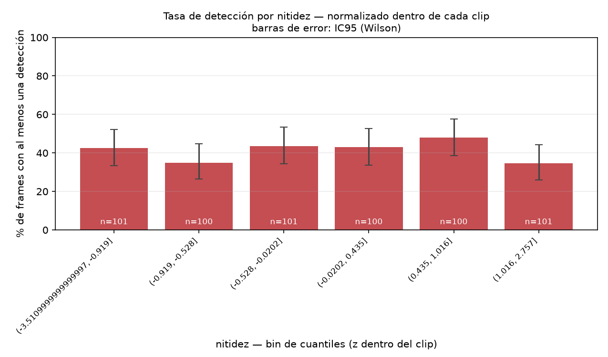
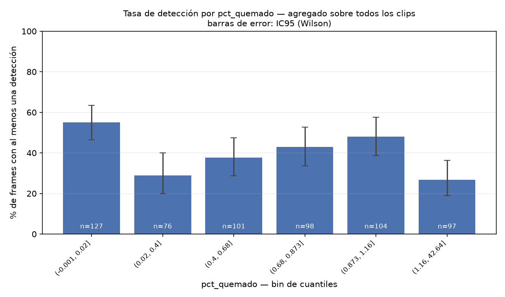
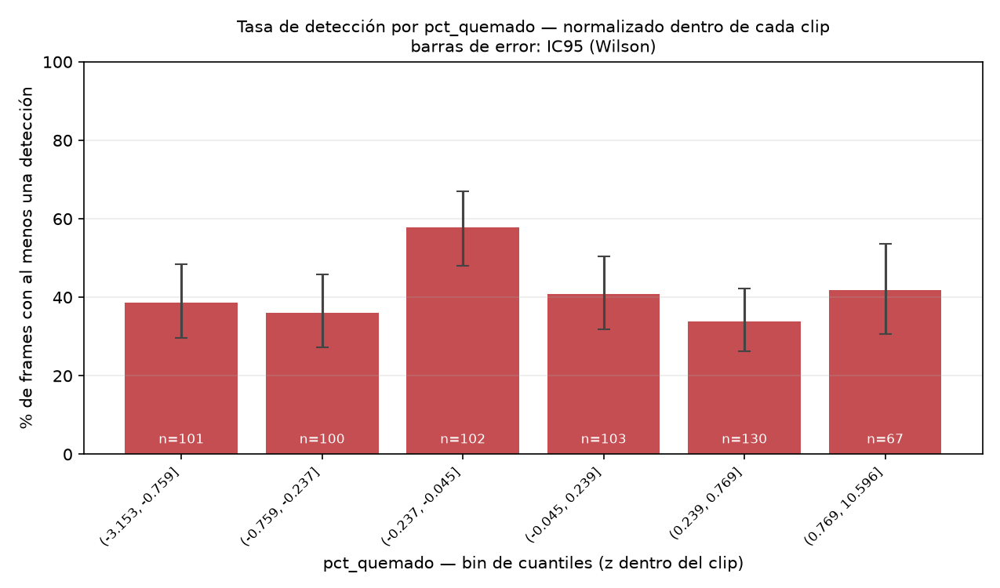

# Reporte — drone-vision

Modelo: `yolov8n.pt` · umbral de confianza: `0.25` · imgsz: `640` · ultralytics: `8.4.121`

- Clips analizados: **10**
- Frames muestreados: **603** (fps de extracción: 1.0)
- Detecciones totales: **387**
- Frames con al menos una detección: **41.1%**
- Frames sin ninguna detección: **355** (58.9% del total)

> **La unidad experimental son los clips, no los frames.** Hay 603 observaciones pero solo 10 tomas independientes. Cualquier patrón que se sostenga en el agregado y desaparezca al normalizar dentro del clip es un efecto de clip, no una relación óptica.

## Correlación con la tasa de detección

Agregado sobre todos los clips vs. normalizado dentro de cada clip (z-score por `video`). Si el signo cambia entre las dos columnas, el patrón agregado es una paradoja de Simpson.

| métrica      |   pearson_agregado |   pearson_dentro_de_clip |   spearman_agregado |   spearman_dentro_de_clip |
|:-------------|-------------------:|-------------------------:|--------------------:|--------------------------:|
| brillo_medio |              0.124 |                   -0.128 |               0.114 |                    -0.129 |
| nitidez      |              0.017 |                    0.003 |               0.016 |                     0.001 |
| pct_quemado  |             -0.036 |                    0.014 |              -0.106 |                    -0.003 |

## Por clip

| clip                      |   frames |   detecciones |   tasa_deteccion_pct |   brillo_medio |   nitidez_media |   quemado_medio_pct |
|:--------------------------|---------:|--------------:|---------------------:|---------------:|----------------:|--------------------:|
| DJI_20260817185708_0001_D |       27 |            34 |                 55.6 |          122.8 |          1065.4 |                0.46 |
| DJI_20260817185751_0002_D |       42 |            32 |                 57.1 |          134.3 |           768.3 |                0.72 |
| DJI_20260817185843_0003_D |       47 |            20 |                 36.2 |          139.5 |          1475.2 |                0.96 |
| DJI_20260817185938_0004_D |       37 |             5 |                 13.5 |          120.5 |          1451   |                0.41 |
| DJI_20260817190026_0005_D |       36 |            13 |                 30.6 |          130.2 |          2383.9 |                0.77 |
| DJI_20260817190115_0006_D |      155 |           167 |                 57.4 |          126   |           888.9 |                1.11 |
| DJI_20260817190510_0007_D |       55 |            20 |                 18.2 |          110   |           527.5 |                1.63 |
| DJI_20260817190613_0008_D |       38 |             0 |                  0   |          110   |           464.8 |                1.75 |
| DJI_20260817190704_0009_D |       72 |            51 |                 63.9 |          131.5 |           900.2 |                0.02 |
| DJI_20260817190838_0010_D |       94 |            45 |                 33   |          125.5 |           710.4 |                0.62 |

## Por clase detectada

| clase         |   n_detecciones |   confianza_media |   confianza_std |
|:--------------|----------------:|------------------:|----------------:|
| car           |             168 |             0.403 |           0.144 |
| kite          |              50 |             0.382 |           0.09  |
| train         |              31 |             0.465 |           0.162 |
| person        |              23 |             0.514 |           0.214 |
| truck         |              20 |             0.369 |           0.136 |
| airplane      |              13 |             0.305 |           0.044 |
| bus           |              13 |             0.331 |           0.054 |
| broccoli      |              11 |             0.414 |           0.142 |
| traffic light |              11 |             0.36  |           0.072 |
| bench         |               8 |             0.4   |           0.124 |
| cell phone    |               6 |             0.424 |           0.17  |
| parking meter |               6 |             0.462 |           0.132 |
| potted plant  |               6 |             0.296 |           0.045 |
| clock         |               5 |             0.359 |           0.068 |
| boat          |               4 |             0.39  |           0.13  |
| suitcase      |               3 |             0.365 |           0.13  |
| toilet        |               3 |             0.332 |           0.019 |
| sports ball   |               2 |             0.318 |           0.069 |
| refrigerator  |               1 |             0.819 |         nan     |
| sink          |               1 |             0.378 |         nan     |
| bird          |               1 |             0.322 |         nan     |
| umbrella      |               1 |             0.462 |         nan     |

## Tasa de detección por brillo (media del canal V)

**Agregado sobre todos los clips** (IC95 de Wilson):

| brillo_medio (bin)   |   frames |   con_deteccion |   tasa_deteccion_pct |   ic95_bajo |   ic95_alto |
|:---------------------|---------:|----------------:|---------------------:|------------:|------------:|
| (35.899, 117.267]    |      101 |              26 |                 25.7 |        18.2 |        35   |
| (117.267, 123.12]    |      100 |              32 |                 32   |        23.7 |        41.7 |
| (123.12, 128.05]     |      101 |              46 |                 45.5 |        36.2 |        55.2 |
| (128.05, 131.14]     |      101 |              63 |                 62.4 |        52.6 |        71.2 |
| (131.14, 133.84]     |      100 |              38 |                 38   |        29.1 |        47.8 |
| (133.84, 201.42]     |      100 |              43 |                 43   |        33.7 |        52.8 |

**Normalizado dentro de cada clip** (z-score por clip):

| brillo_medio z (bin)   |   frames |   con_deteccion |   tasa_deteccion_pct |   ic95_bajo |   ic95_alto |
|:-----------------------|---------:|----------------:|---------------------:|------------:|------------:|
| (-6.713, -0.787]       |      101 |              51 |                 50.5 |        40.9 |        60   |
| (-0.787, -0.295]       |      100 |              45 |                 45   |        35.6 |        54.8 |
| (-0.295, 0.0028]       |      102 |              41 |                 40.2 |        31.2 |        49.9 |
| (0.0028, 0.254]        |       99 |              41 |                 41.4 |        32.2 |        51.3 |
| (0.254, 0.665]         |      100 |              45 |                 45   |        35.6 |        54.8 |
| (0.665, 6.437]         |      101 |              25 |                 24.8 |        17.4 |        34   |

## Tasa de detección por nitidez (varianza del laplaciano)

**Agregado sobre todos los clips** (IC95 de Wilson):

| nitidez (bin)       |   frames |   con_deteccion |   tasa_deteccion_pct |   ic95_bajo |   ic95_alto |
|:--------------------|---------:|----------------:|---------------------:|------------:|------------:|
| (1.669, 406.113]    |      101 |              24 |                 23.8 |        16.5 |        32.9 |
| (406.113, 807.413]  |      100 |              40 |                 40   |        30.9 |        49.8 |
| (807.413, 930.92]   |      101 |              66 |                 65.3 |        55.7 |        73.9 |
| (930.92, 1085.227]  |      100 |              49 |                 49   |        39.4 |        58.7 |
| (1085.227, 1403.35] |      100 |              33 |                 33   |        24.6 |        42.7 |
| (1403.35, 2580.98]  |      101 |              36 |                 35.6 |        27   |        45.4 |

**Normalizado dentro de cada clip** (z-score por clip):

| nitidez z (bin)               |   frames |   con_deteccion |   tasa_deteccion_pct |   ic95_bajo |   ic95_alto |
|:------------------------------|---------:|----------------:|---------------------:|------------:|------------:|
| (-3.5109999999999997, -0.919] |      101 |              43 |                 42.6 |        33.4 |        52.3 |
| (-0.919, -0.528]              |      100 |              35 |                 35   |        26.4 |        44.7 |
| (-0.528, -0.0202]             |      101 |              44 |                 43.6 |        34.3 |        53.3 |
| (-0.0202, 0.435]              |      100 |              43 |                 43   |        33.7 |        52.8 |
| (0.435, 1.016]                |      100 |              48 |                 48   |        38.5 |        57.7 |
| (1.016, 2.757]                |      101 |              35 |                 34.7 |        26.1 |        44.3 |

## Tasa de detección por % de píxeles quemados

**Agregado sobre todos los clips** (IC95 de Wilson):

| pct_quemado (bin)   |   frames |   con_deteccion |   tasa_deteccion_pct |   ic95_bajo |   ic95_alto |
|:--------------------|---------:|----------------:|---------------------:|------------:|------------:|
| (-0.001, 0.02]      |      127 |              70 |                 55.1 |        46.4 |        63.5 |
| (0.02, 0.4]         |       76 |              22 |                 28.9 |        20   |        40   |
| (0.4, 0.68]         |      101 |              38 |                 37.6 |        28.8 |        47.4 |
| (0.68, 0.873]       |       98 |              42 |                 42.9 |        33.5 |        52.7 |
| (0.873, 1.16]       |      104 |              50 |                 48.1 |        38.7 |        57.6 |
| (1.16, 42.64]       |       97 |              26 |                 26.8 |        19   |        36.4 |

**Normalizado dentro de cada clip** (z-score por clip):

| pct_quemado z (bin)   |   frames |   con_deteccion |   tasa_deteccion_pct |   ic95_bajo |   ic95_alto |
|:----------------------|---------:|----------------:|---------------------:|------------:|------------:|
| (-3.153, -0.759]      |      101 |              39 |                 38.6 |        29.7 |        48.4 |
| (-0.759, -0.237]      |      100 |              36 |                 36   |        27.3 |        45.8 |
| (-0.237, -0.045]      |      102 |              59 |                 57.8 |        48.1 |        67   |
| (-0.045, 0.239]       |      103 |              42 |                 40.8 |        31.8 |        50.4 |
| (0.239, 0.769]        |      130 |              44 |                 33.8 |        26.3 |        42.3 |
| (0.769, 10.596]       |       67 |              28 |                 41.8 |        30.7 |        53.7 |

